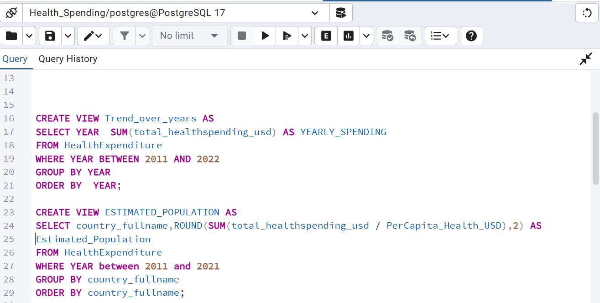
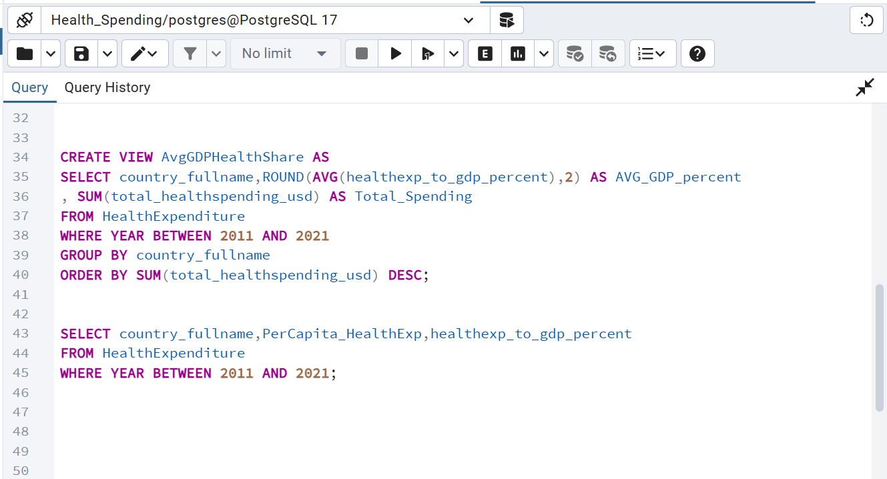
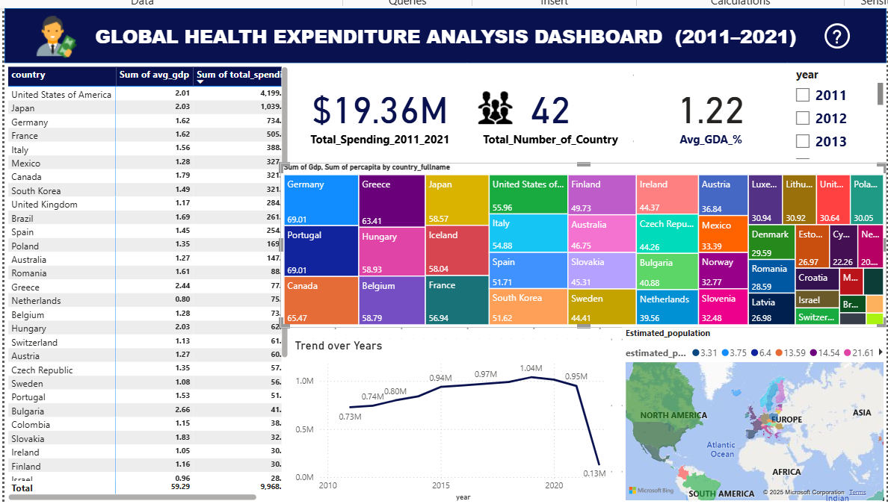

# Comparative-Analysis-of-Global-Pharmaceutical-and-Health-Spending-2011-2021

## TABLE OF CONTENT

- [INTRODUCTION](#Introduction)

- [DATA DESCRIPTION](#Data-Description)

- [Data Collection and Preparation ](#Data-Collection-and-Preparation)

- [Data Analysis](#Data-Analysis)

- [Skills demonstrated](#Skills-demonstrated)

- [Visualizations](#Visualizations)

- [Insight from analysis](#Insight-from-analysis)

- [Summary of Analysis](#Summary-of-Analysis)

- - [Conclusion](#Conclusion)

## INTRODUCTION
Healthcare spending is a critical indicator of a country’s commitment to improving the well-being of its population. Over the years, governments and private sectors worldwide have allocated significant resources to pharmaceutical and health services to ensure access to quality healthcare. The dataset used in this study provides a comparative overview of global pharmaceutical and health expenditure across multiple countries between 1971 and 2021, with a primary focus on the period 2011–2022.
y analyzing these indicators, the study aims to uncover patterns, trends, and disparities in global health financing. Specifically, it provides insights into which countries allocate the largest share of their GDP to health, which nations experience the fastest growth in spending, and how per capita health expenditure has evolved over time

## Data-Description
The dataset contains annual records of global pharmaceutical and health expenditure for multiple countries between 2011 and 2021, with a primary focus on 2011–2021 for detailed analysis. It consists of the following key variables:- Country_Code
- Country_Code: Serves as a unique identifier for each country in the dataset.
- country_fullname: Full name of the country corresponding to the code (e.g., Australia, Switzerland, United States).
- Year: The year of observation (e.g., 1971, 1980, 2011, 2021).
- PerCapita_HealthExp: Average health expenditure per person in the country’s local currency.
- HealthExp_to_GDP_percent: Share of national Gross Domestic Product (GDP) devoted to healthcare.
- PerCapita_Health_USD: Average health expenditure per person converted into US dollars.
- Total_HealthSpending_USD: The total national expenditure on healthcare in millions of US dollars.

## Data Collection and Preparation 
#### Raw data:
The dataset on Global Pharmaceutical and Health Expenditure (1971–2021) was obtained from publicly available OECD (Organisation for Economic Co-operation and Development) and World Bank Health Statistics.
[Download Health spending](data_SQL.csv)

### Tools used: Excel, SQL, Powerbi

## SKILLS DEMONSTRATED:
 - Excel:
    - Adding a new column: Country_Fullname
 - SQL:
       -  Creating a new Database called Health_Spending
       -  create a table HealthExpenditure using Columns and their bconstraints
        - 
   
       - Importing the Dataset into SQL: The dataset, provided in CSV format, was imported into
            PostgreSQL for structured storage and analysis. Importing the CSV into SQL allowed for easier
       querying, aggregation, and integration with visualization tools.
   
       - The dataset was analyzed using SQL to derive meaningful insights. After completing
         the analysis, the results were saved as a database view to simplify future queries and ensure
        consistency. This view was then connected to Power BI, where interactive dashboards and visualizations were
        created to better understand trends, patterns, and comparisons across countries between 2011 and 2021.
   
  - 
   
  - 
   

   
 - Powerbi: created several measures using DAX (Data Analysis Expressions) to perform dynamic calculations. These measures included  total health spending, average share of GDP spent on health and number of country.
      - Data visualization 
      - Dashboard development 
      - Insight Generation 
       
### ## Data Analysis:
       - Trend over Years
       - Estimated_population
       - Sum of Gdp, Sum of percapita by country_fullname
       - Avg_Gdp_sum_of_total_Health_spending

## Visualizations:
To better understand the trends and patterns in global health and pharmaceutical spending, the dataset was connected from PostgreSQL to Power BI,
where several interactive dashboards and visualizations were created. These visualizations provide deeper insights into the data between 2011 and 2021.
  - Map Visualization
  - Line Charts (Trend Analysis)
  - Treemap
  - Tables
  - Summary Dashboard: All these visualizations were combined into a comprehensive dashboard with slicers and filters, allowing dynamic exploration of the data by year, country,
  - 

## Insight from analysis
   - Variation in GDP Allocation: Some countries, such as the United States, Germany, and France, consistently allocate a larger share of GDP to health.
   - Rising Health Expenditure Globally accross most countries, total health spending increased steadily between 2011 and 2021, reflecting growing investments in healthcare infrastructure, pharmaceuticals, and medical technologies.
   - Fastest-Growing Countries in Spending'Countries like South Korea and Chile recorded some of the fastest growth rates in total health spending, showing rapid improvements in healthcare investment.
   - Population-Driven Spending: Larger countries such as USA, Japan, and Germany dominate in total spending, but when adjusted per capita, smaller wealthy nations like Luxembourg and Switzerland often lead.
   - 
## Summary-of-Analysis
larger countries like the USA, Japan, and Germany record the highest total health spending due to their large populations. However, when adjusted per person, smaller wealthy nations such as Luxembourg and Switzerland lead in per capita spending, showing that citizens in these countries benefit from greater individual healthcare investment.

## Conclusion
The comparative analysis of global pharmaceutical and health spending (2011–2021) reveals clear patterns in healthcare investment worldwide. While large economies such as the United States, Japan, and Germany dominate in total health expenditure, smaller but wealthier nations like Luxembourg and Switzerland lead in per capita spending, reflecting higher individual investment in healthcare.
This suggests that while healthcare systems are expanding globally, inequalities in access and affordability remain, and future policies must focus on improving efficiency, equity, and sustainability of healthcare financing worldwide.
