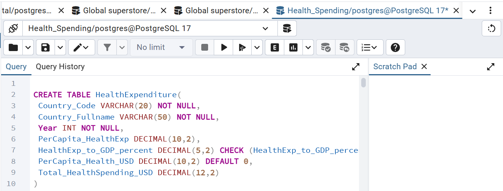

# Comparative-Analysis-of-Global-Pharmaceutical-and-Health-Spending-2011-2021

## TABLE OF CONTENT

- [INTRODUCTION](#Introduction)

- [DATA DESCRIPTION](#Data-Description)

- [Data Collection and Preparation ](#Data-Collection-and-Preparation)

- [Data Analysis](#Data-Analysis)

- [Skills demonstrated](#Skills-demonstrated)

- [Visualizations](#Visualizations)

- [Insight from analysis](#Insight-from-analysis)

- [Summary of Analysis](#Summary-of-Analysis)

- - [Conclusion](#Conclusion)

## INTRODUCTION
Healthcare spending is a critical indicator of a country’s commitment to improving the well-being of its population. Over the years, governments and private sectors worldwide have allocated significant resources to pharmaceutical and health services to ensure access to quality healthcare. The dataset used in this study provides a comparative overview of global pharmaceutical and health expenditure across multiple countries between 1971 and 2021, with a primary focus on the period 2011–2022.
y analyzing these indicators, the study aims to uncover patterns, trends, and disparities in global health financing. Specifically, it provides insights into which countries allocate the largest share of their GDP to health, which nations experience the fastest growth in spending, and how per capita health expenditure has evolved over time

## Data-Description
The dataset contains annual records of global pharmaceutical and health expenditure for multiple countries between 2011 and 2021, with a primary focus on 2011–2021 for detailed analysis. It consists of the following key variables:- Country_Code
- Country_Code: Serves as a unique identifier for each country in the dataset.
- country_fullname: Full name of the country corresponding to the code (e.g., Australia, Switzerland, United States).
- Year: The year of observation (e.g., 1971, 1980, 2011, 2021).
- PerCapita_HealthExp: Average health expenditure per person in the country’s local currency.
- HealthExp_to_GDP_percent: Share of national Gross Domestic Product (GDP) devoted to healthcare.
- PerCapita_Health_USD: Average health expenditure per person converted into US dollars.
- Total_HealthSpending_USD: The total national expenditure on healthcare in millions of US dollars.

## Data Collection and Preparation 
#### Raw data:
The dataset on Global Pharmaceutical and Health Expenditure (1971–2021) was obtained from publicly available OECD (Organisation for Economic Co-operation and Development) and World Bank Health Statistics.
[Download Health spending](data_SQL.csv)

### Tools used: Excel, SQL, Powerbi

## SKILLS DEMONSTRATED:
 - Excel:
    - Adding a new column: Country_Fullname
 - SQL:
       -  Creating a new Database called Health_Spending
       -  create a table HealthExpenditure using Columns and their bconstraints
       - 
       -Imorting the Dataset csv file to Sql
       - The dataset was analyzed using SQL to derive meaningful insights. After completing the analysis, the results were saved as a database view to simplify future queries and ensure consistency. This view was then connected to Power BI, where interactive dashboards and visualizations were created to better understand trends, patterns, and comparisons across countries between 2011 and 2021
       
### ## Data Analysis:

